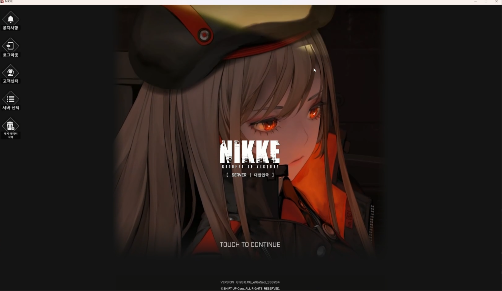
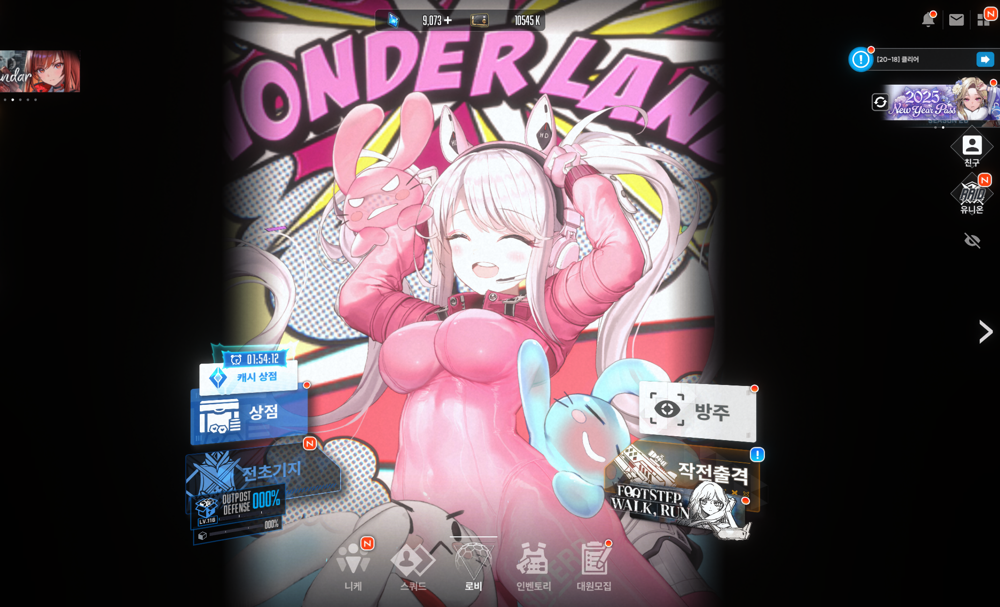

# **승리의 여신: 니케 - 자동화 프로그램** 🚀

---

## **목차** 📚
- [프로그램 개요](#프로그램-개요)
- [주요 기능 ✨](#주요-기능-)
- [설치 방법 🛠️](#설치-방법-️)
  - [1. 프로젝트 클론](#1-프로젝트-클론)
  - [2. 가상환경 설정](#2-가상환경-설정)
  - [3. 의존성 패키지 설치](#3-의존성-패키지-설치)
- [사용 방법 🚀](#사용-방법-🚀)
- [프로세스 요약](#프로세스-요약)
- [문의 및 피드백 💬](#문의-및-피드백-💬)

---

### **프로그램 개요**
**승리의 여신: 니케 자동화 프로그램**은 반복적인 일일숙제를 자동으로 수행하는 **자동화 프로그램**입니다.  
이 프로그램은 **화면 캡처**, **템플릿 매칭**, **자동 클릭** 등 여러가지 기능을 통해 효율적인 자동화 기능을 지원합니다.

---

## **주요 기능** ✨

1. ~~**화면 캡처**~~  
   - ~~현재 게임 화면을 캡처하고 저장합니다.~~  

2. ~~**템플릿 매칭**~~  
   - ~~OpenCV를 활용해 템플릿 이미지와 현재 화면을 비교하여 특정 좌표를 찾아냅니다.~~  

3. ~~**자동 클릭**~~  
   - ~~매칭된 좌표를 바탕으로 클릭, 마우스 이동, 드래그 등의 동작을 자동으로 수행합니다.~~  

4. ~~**클릭 후 마킹된 이미지 저장**~~ 
   - ~~클릭한 좌표를 강조 표시한 이미지를 저장해 테스트 증적을 남깁니다.~~  

5. ~~**유연한 로그 관리**~~  
   - ~~프로그램 실행 로그를 저장하고, 오래된 로그를 자동으로 정리합니다.~~  

---

## **설치 방법** 🛠️

### **1. 프로젝트 클론**
GitHub에서 프로젝트를 클론합니다:
```bash
git clone https://github.com/your-username/NikkePCAuto.git
cd NikkePCAuto
```

### **2. 가상환경 설정**  
Python 가상환경을 설정하고 활성화합니다:

```bash
# 가상환경 생성
python -m venv venv

# 가상환경 활성화 (Windows)
venv\Scripts\activate

# 가상환경 활성화 (Mac/Linux)
source venv/bin/activate
```

### **3. 의존성 패키지 설치**  
프로그램 실행에 필요한 패키지를 설치합니다:

```bash
pip install -r requirements.txt
```

## **사용 방법** 🚀
1. 바탕화면 우클릭 디스플레이 설정 > 배율 100%, 해상도 2560 X 1440 사용 
```
python main.py
=main.py 실행
```
#### **예상 동작**  
1. 게임 화면을 캡처합니다.  
2. 템플릿 이미지와 비교해 로그인 버튼 위치를 찾습니다.  
3. 해당 좌표를 클릭한 후, 좌표가 표시된 스크린샷을 저장합니다.  

# **프로세스 요약**

## 1. 로그인
- **아이콘 클릭 → 구글 로그인 → 게임 시작**
  - *(개인 화면에 맞춰져 있어, 주석 처리 필요)* 
  이미지를 클릭하면 관련 **TEST 영상**으로 이동합니다.  
[](https://youtu.be/3wYeTSn5ddA) 

---

## 2~7. 일일 절차
다음 5가지 절차를 보여주는 영상입니다. 
[](https://www.youtube.com/watch?v=ot94f_7yCIQ)  

### **2. 일일 출석**
- **알림 → 일일 보상 수령 → 100P 받기 및 출석 체크**

### **3. 친구 목록 관리**
- **하트 보내기**

### **4. 우편함 수령**
- **모든 보상 받기**

### **5. 상점 관리**
- **일일 무료 아이템 획득**

### **6. 파견**
- **전초기지 일일 파견**

### **7. 일일 전투 보상 획득**
- **단기 섬멸 1회 진행**

---

## 7. 방주 트라이브 타워 진행

## 8. 니케 상담

---

### **참고 사항**
- 필요 없거나 실행이 잘 되지 않는 절차는 `main.py`에서 해당 코드를 주석 처리해 주세요.

---

### **참고 사항**
- 필요 없거나 실행이 잘 되지 않는 절차는 `main.py`에서 해당 코드를 주석 처리해 주세요.<br>
불법이륙으로 제가 스토리를 못밀어서 약합니다.. 몇몇 절차 구현이 불가합니다 ㅜㅜ..

## **문의 및 피드백** 💬  
프로그램에 대한 질문이나 개선 사항은 [GitHub Issues](https://github.com/EazyNick/NikkePCAuto/issues)에 남겨주세요. <br>

**승리의 여신: 니케 자동화 프로그램**은 반복 작업을 효율화하고, 정확도를 높이기 위해 설계되었습니다.  
프로그램 사용을 통해 프로세스를 더욱 **자동화**하고 **최적화**할 수 있습니다! 😊
